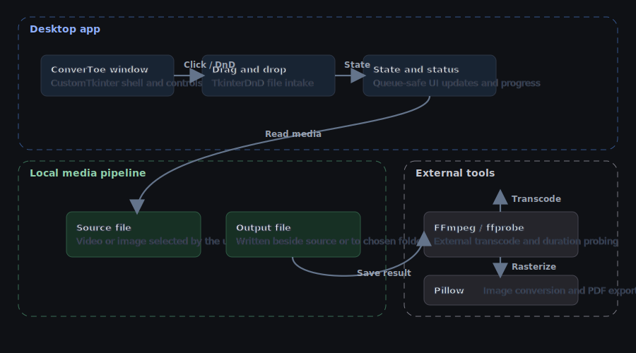
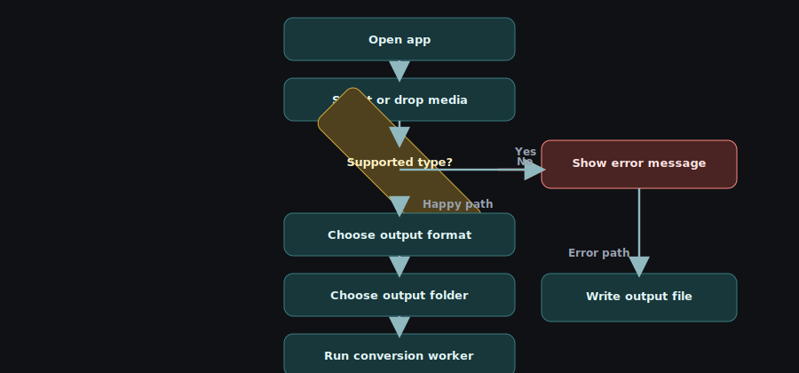

# ConverToe

<!-- markdownlint-disable MD033 -->

<p align="center">
  
</p>

<p align="center">
  
  
  
  
  
</p>

ConverToe is a single-file desktop converter for quick video and image transcodes, with drag-and-drop input, automatic media detection, and a clean status/progress loop that keeps the whole thing pleasantly boring in the best way.

## What even is this?

ConverToe is a lightweight Python desktop app that takes one media file at a time, detects whether it is a video or image, and converts it into a format you choose. The UI is built with CustomTkinter and TkinterDnD, while conversion work is delegated to FFmpeg for video/audio and Pillow for image handling.

## Why does this exist?

Because sometimes you want a small local utility that does one job without opening a browser tab, asking you to sign in, or pretending your one-off conversion is a product funnel. ConverToe is meant to stay close to the file system, be easy to run, and get out of the way.

## Features

- Drag and drop support for a single media file.
- File picker fallback for the same workflow.
- Automatic detection for video and image inputs.
- Video output to MP3, WAV, FLAC, or AAC.
- Image output to PNG, JPEG, WebP, or PDF.
- Output folder selection, or save next to the source file.
- Progress updates and status messages during conversion.
- Local-only workflow with no network dependency.
- Automatic installation of missing Python dependencies on launch.

## Architecture

<p align="center">
  
</p>

The app is intentionally simple: the desktop UI collects a file, helper functions classify it, FFmpeg or Pillow does the conversion, and the output lands on disk with progress fed back into the UI queue.

## How it works

<p align="center">
  
</p>

The flow is straightforward: load a file, confirm the media type, choose the output settings, run the worker thread, and write the result while the UI stays responsive.

## Tech stack

| Technology | Role | Why we picked it |
| --- | --- | --- |
| Python | Runtime and application logic | The whole app lives in one Python file, so the runtime stays simple. |
| CustomTkinter | Desktop UI toolkit | Gives the app a cleaner modern surface than stock Tk widgets. |
| tkinterdnd2 | Drag and drop support | Enables file drop on the main panel without extra platform code. |
| Pillow | Image conversion | Handles image saves and PDF export cleanly. |
| FFmpeg / ffprobe | Video/audio processing and probing | Required for media transcode and progress tracking. |

## Getting started

### Prerequisites

- Python installed locally.
- FFmpeg available on `PATH`, or bundled as `ffmpeg/ffmpeg.exe`.
- A desktop session that can run Tkinter apps.

### Installation

```bash
python -m pip install customtkinter pillow tkinterdnd2
```

ConverToe also tries to install missing Python packages automatically when the app starts, but installing them yourself keeps startup predictable.

### Configuration

There are no repository-defined environment variables at the moment.

| Variable | Purpose | Status |
| --- | --- | --- |
| None | The current codebase does not read environment variables. | Not used |

### Running locally

```bash
python converter.py
```

## Usage

```bash
python converter.py
```

1. Drag a `.mp4` or `.mov` into the drop zone and convert it to MP3.
2. Browse for a `.mkv`, pick WAV as the output, and save beside the source file.
3. Load a `.png` or `.webp` and export it to PDF for archiving.
4. Choose an output folder before starting if you do not want the result saved next to the source.
5. Use the status bar to confirm when the app has loaded the file and when the conversion finishes.

## Use cases

- Extract audio from a short video clip.
- Convert a screenshot into a shareable PDF.
- Re-encode a graphic into a different delivery format.
- Do a one-off local conversion without opening a web app.

## Project structure

```text
.
├── converter.py # Single-file desktop app entry point and conversion logic.
├── assets/ # Runtime icon assets used by the app window on desktop.
│   ├── convertoe.ico # Windows-friendly desktop icon.
│   └── convertoe.png # PNG fallback for app icon loading.
└── docs/
    └── assets/ # README graphics and SVG source assets.
        ├── banner.svg # Hero banner used in this README.
        ├── architecture.svg # Topology diagram for the app pipeline.
        ├── flow.svg # Conversion lifecycle diagram.
        └── icon.svg # SVG source for the app icon design.
```

## API reference

### converter.py

- `format_size(size)` formats byte counts into readable units.
- `is_video(path)` and `is_image(path)` classify files by extension.
- `get_media_type(path)` returns `video`, `image`, or `None`.
- `ffmpeg_exists()` checks whether the external FFmpeg binary is reachable.
- `ConverToe` is the Tkinter desktop application.
- `ConverToe.setup_ui()` builds the full interface.
- `ConverToe.select_file()` opens the file picker.
- `ConverToe.handle_drop()` accepts drag-and-drop input.
- `ConverToe.load_file()` validates and loads the selected media.
- `ConverToe.update_output_formats()` swaps output options by media type.
- `ConverToe.select_output_dir()` chooses the destination folder.
- `ConverToe.start_conversion()` kicks off the worker thread.
- `ConverToe.convert_video()` runs FFmpeg-based transcodes.
- `ConverToe.convert_image()` runs Pillow-based image exports.
- `ConverToe.queue_ui()` and `ConverToe.process_ui_queue()` keep UI updates thread-safe.
- `ConverToe.status()` updates the status line.

## Development

### Running tests

There is no automated test suite in the repository yet.

For a quick smoke test, run the app and convert one video or image file.

```bash
python converter.py
```

### Contributing

If you change the UI or conversion flow, keep the single-file structure coherent, verify the app still launches, and make sure FFmpeg and Pillow behavior still match the supported formats.

## Roadmap

- [ ] Bundle FFmpeg more cleanly for packaged builds.
- [ ] Add a proper packaged installer with desktop icon metadata.
- [ ] Add a queue for multiple files.
- [ ] Persist the last-used output folder.
- [ ] Add automated smoke tests for the media helpers.

## License

No license file is present in the repository yet. Add one before redistributing the app.

---

Made with care by [the ConverToe project](.).

<!-- markdownlint-enable MD033 -->